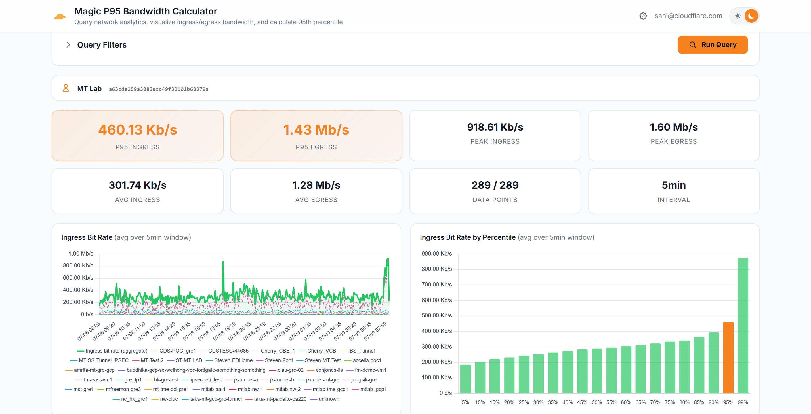

# Magic P95 Analytics



A self-service Cloudflare Workers dashboard for Magic Transit customers to visualize ingress/egress bandwidth across all GRE/IPsec tunnels and CNI interconnects, and calculate the **95th percentile (P95)** bandwidth — the standard billing metric for Magic Transit.

The Cloudflare dashboard does not natively display a P95 bandwidth figure. This tool automates the process described in the [Cloudflare P95 bandwidth guide](https://developers.cloudflare.com/magic-transit/analytics/query-bandwidth/): querying 5-minute interval traffic data, aggregating across tunnels, and computing P95.

## What It Does

1. **Queries the Cloudflare GraphQL Analytics API** at 5-minute granularity for maximum P95 accuracy
2. **Automatically chunks queries** into weekly windows and runs them **in parallel** to stay within the 10,000 row API limit while minimizing latency
3. **Sums bandwidth across all GRE/IPsec tunnels and CNI interconnects** per 5-minute interval, then computes the 95th percentile
4. **Renders an interactive dashboard** with per-tunnel time-series charts, percentile distributions, and summary cards

## Features

### P95 Calculation
- **Accurate 95th percentile** using the nearest-rank method on aggregated 5-minute interval bit rates
- **Per-tunnel breakdown** — individual tunnel lines plotted alongside the aggregate on time-series charts
- **CIDR subset analysis** — when source/destination CIDR filters are set, a second query runs against the Network Analytics dataset and the result is shown as a percentage of the total P95 (e.g., "24.3% of total P95")

### Multi-Account Management
- **Store multiple Cloudflare accounts** per user with labels, account tags, and API tokens
- **Set a default account** that auto-selects on page load
- **Interactive account switcher** — dropdown in the header with tunnel auto-discovery on switch
- **Active account bar** — always-visible indicator showing the selected account name and tag

### Query & Filtering
- **Direction filter** — ingress, egress, or both; charts and summary cards hide/show dynamically
- **Multi-select tunnel filter** — select individual tunnels or "Select All"; tunnels auto-discovered on page load
- **Region tags & filter** — tag each tunnel/interconnect with a region (see below) and scope queries to one or more regions
- **CIDR filtering** — filter by one or more source and/or destination IP prefixes (one per line) for subset analysis
- **Time range presets** — 1h, 6h, 24h, 2d, 7d, 14d, 30d, or custom date range (clamped to 16-week data retention)
- **Collapsible filter panel** — collapse the query filters to focus on the data view

### Per-Region P95 Analytics
- **Region metadata tags** — assign a region to each tunnel/interconnect directly from the Tunnels/Interconnects dropdown. Tags are stored **per account** (shared across users of that account) in D1.
- **On-demand reconciliation** — every time tunnels are enumerated (page load, account switch, token test), tags are synced: surviving tunnels keep their tags and tags for **removed** tunnels/interconnects are automatically deleted.
- **Per-region breakdown** — a dedicated section renders per-region P95 summary cards (ingress/egress P95, peak, avg) plus a grouped time-series chart with one line per region.
- **Region scoping** — the query's Regions filter restricts results to tunnels tagged with the selected region(s).
- Available regions: **Global (Geo Container)**, **North America (NAMR)**, **Europe (EURP)**, **Asia (ASIA)**, **AUS/NZ (ANZL)**, **China (CHNA)**, **India (INDA)**, **Korea (KREA)**, **South America (LAMR)**, **Middle East & Africa (MEAF)**, **Taiwan (TAWN)**.

### Data & Export
- **4-panel chart dashboard** — ingress/egress time-series (with per-tunnel lines and legend) + percentile distribution bar charts
- **Raw data table** — sortable time-series data points
- **CSV export** — download all data including P95 values, CIDR subset breakdown, and per-direction statistics
- **Parallel query execution** — all weekly chunks and directions execute concurrently for fast results on long time ranges

### Infrastructure
- **Multi-user with D1 persistence** — per-user account settings and query history stored in Cloudflare D1
- **Token validation** — Test Token verifies the account-level API token has the correct permissions and discovers available tunnels
- **Cloudflare Access authentication** — protected behind Zero Trust with JWT validation
- **Dark/light theme** with Cloudflare branding
- **Weekly chunking** — automatically splits time ranges into weekly API calls, runs them in parallel, merges results

## How P95 Works

P95 means **95% of your 5-minute intervals had bandwidth at or below this value** — only 5% of intervals exceeded it. This is the standard billing metric for Magic Transit.

The calculation:
1. Fetches `bitRateFiveMinutes` (avg bit rate per 5-min bucket) for each tunnel via `magicTransitTunnelTrafficAdaptiveGroups`
2. Filters to selected tunnels (if any)
3. Sums bit rates across all selected tunnels per 5-minute interval to get aggregate bandwidth
4. Removes zero-traffic intervals (these don't count toward billing)
5. Sorts all values ascending and picks the value at index `ceil(0.95 × N) - 1` (nearest-rank method)

### CIDR Subset Analysis
When source or destination CIDR filters are applied:
- The **total P95** is always calculated from the tunnel dataset (the billing metric)
- A **supplementary query** runs against `magicTransitNetworkAnalyticsAdaptiveGroups` with the IP filters
- The CIDR P95 is displayed alongside the total, with the **percentage of total** (e.g., "src: 10.0.0.0/8 — P95: 120 Mbps, 24% of total")

### Accuracy & Data Considerations

- **Adaptive Bit Rate (ABR) sampling** — The `magicTransitTunnelTrafficAdaptiveGroups` dataset uses Cloudflare's [ABR sampling](https://developers.cloudflare.com/analytics/sampling/), which stores data at multiple resolutions (100%, 10%, 1%) and dynamically selects the best resolution per query. Aggregated metrics like averages and percentiles are extrapolated to represent the full dataset, so sampling does not distort the P95 result.
- **5-minute averaging** — `bitRateFiveMinutes` is the **average** bit rate over each 5-minute window, not an instantaneous or peak measurement. Sub-minute traffic spikes within a bucket are smoothed by this averaging. This is the same granularity used by Cloudflare for Magic Transit billing.
- **Weekly chunking reduces sampling** — By splitting queries into 7-day windows (≤10,000 rows each), the tool keeps per-query row counts low, which encourages ABR to return higher-resolution (less sampled) data.
- **Billing methodology alignment** — This tool follows the [official Cloudflare P95 bandwidth guide](https://developers.cloudflare.com/magic-transit/analytics/query-bandwidth/), using the same dataset, granularity, and calculation method.

## Setup From Scratch

### Prerequisites

- A **Cloudflare account** with Magic Transit or Magic WAN (Enterprise plan)
- **Node.js** 18+ and **npm**
- **Wrangler CLI** (`npm install -g wrangler`) — authenticated with `wrangler login`
- A **custom domain** (optional) managed by Cloudflare, for deploying behind Access

### Step 1: Clone and install

```bash
git clone <this-repo>
cd p95-calculator
npm install
```

### Step 2: Create a D1 database

```bash
npx wrangler d1 create p95-calc-db
```

Copy the `database_id` from the output and paste it into `wrangler.toml`:

```toml
[[d1_databases]]
binding = "DB"
database_name = "p95-calc-db"
database_id = "YOUR_DATABASE_ID_HERE"
```

### Step 3: Initialize the database schema

```bash
# For production:
npx wrangler d1 execute p95-calc-db --remote --file=./schema.sql

# For local dev:
npx wrangler d1 execute p95-calc-db --local --file=./schema.sql
```

### Step 4: Configure your domain (optional)

If you want the tool on a custom domain (e.g., `p95.example.com`), add a route in `wrangler.toml`:

```toml
routes = [
  { pattern = "p95.example.com/*", zone_name = "example.com" }
]
```

Make sure the domain has a DNS record (e.g., a proxied AAAA record to `100::`) pointing to Cloudflare.

### Step 5: Set up Cloudflare Access (recommended)

To protect the dashboard behind authentication:

1. Go to **Cloudflare Zero Trust** → **Access** → **Applications**
2. Create a new **Self-hosted** application
3. Set the **Application domain** to your custom domain (e.g., `p95.example.com`)
4. Add an **Identity Provider** (e.g., Google, GitHub, Okta, OneLogin)
5. Create an **Access Policy** to control who can access the tool (e.g., allow emails ending in `@yourcompany.com`)

The worker reads the `CF_ACCESS_TEAM_DOMAIN` variable from `wrangler.toml` to identify your Zero Trust team:

```toml
[vars]
ENVIRONMENT = "production"
CF_ACCESS_TEAM_DOMAIN = "your-team-name"   # from <your-team-name>.cloudflareaccess.com
```

### Step 6: Deploy

```bash
npm run deploy
```

### Step 7: Add accounts and API tokens

Each user creates their own **account-level** API token at https://dash.cloudflare.com/profile/api-tokens:

1. Click **Create Token**
2. Use the **Custom Token** template
3. Add permission: **Account** → **Account Analytics** → **Read**
4. Under **Account Resources**, select the specific account(s) the token should access — this is an account-scoped token, not a zone-scoped token
5. Copy the token

> **Important:** The token must be an **account-level** token with **Account Analytics: Read** permission. Zone-level permissions or other scopes (e.g. DNS, Firewall) are not sufficient. The token must also be scoped to the specific Cloudflare account(s) you intend to query — a token scoped to a different account will return permission errors.

Then in the dashboard, click the ⚙️ gear icon to open Settings:

1. Click **+ Add Account**
2. Enter a **Label** (friendly name), **Account Tag** (hex string from the dashboard URL), and **API Token**
3. Click **Test Token** to verify the token has the correct permissions and is scoped to the right account
4. Click **Save** — the tool will discover available tunnels
5. Repeat for additional accounts
6. Click **Set Default** on the account you want auto-selected on page load
7. Select the active account from the dropdown in the header

## Local Development

Create a `.dev.vars` file to bypass Access auth locally:

```
ENVIRONMENT=development
```

Then run:

```bash
npx wrangler d1 execute p95-calc-db --local --file=./schema.sql   # first time only
npm run dev
```

The dashboard will be available at `http://localhost:8787` without authentication.

## Tech Stack

- **Cloudflare Worker** — TypeScript + [Hono](https://hono.dev) framework
- **D1** — SQLite database for per-user settings and query history
- **Cloudflare Access** — Zero Trust authentication (JWT-based)
- **Chart.js** — Time-series and bar charts
- **Tailwind CSS** — Styling via CDN

## GraphQL Datasets

| Dataset | Used For |
|---------|----------|
| `magicTransitTunnelTrafficAdaptiveGroups` | Tunnel-level bandwidth (bit rates per 5-min interval, bits, packets). Primary dataset for P95 calculation. |
| `magicTransitNetworkAnalyticsAdaptiveGroups` | Packet-level analytics with source/destination IP CIDR filtering. Used when CIDR filters are applied. |

**API limits**: 10,000 rows per query, 300 queries per 5 minutes. The tool automatically chunks time ranges into weekly windows and queries each direction separately to stay within limits.

**Data retention**: Network Analytics data is retained for **16 weeks**.

## Project Structure

```
src/
├── index.ts      # Hono app — API routes (settings, query, test-token), middleware
├── auth.ts       # Cloudflare Access JWT authentication middleware
├── graphql.ts    # GraphQL query builder with parallel weekly chunking
├── p95.ts        # 95th percentile calculation (nearest-rank method)
├── types.ts      # TypeScript interfaces (BandwidthQuery, BandwidthResult, etc.)
├── ui.ts         # Single-page dashboard HTML (Tailwind + Chart.js)
└── p95.png       # Header graphic
schema.sql                # D1 database schema
migrate-multi-account.sql # Migration for multi-account + default account support
migrate-region-tags.sql   # Migration for per-account tunnel region tags
wrangler.toml             # Worker configuration
```

## Author

Jeff Sani — sani@cloudflare.com
